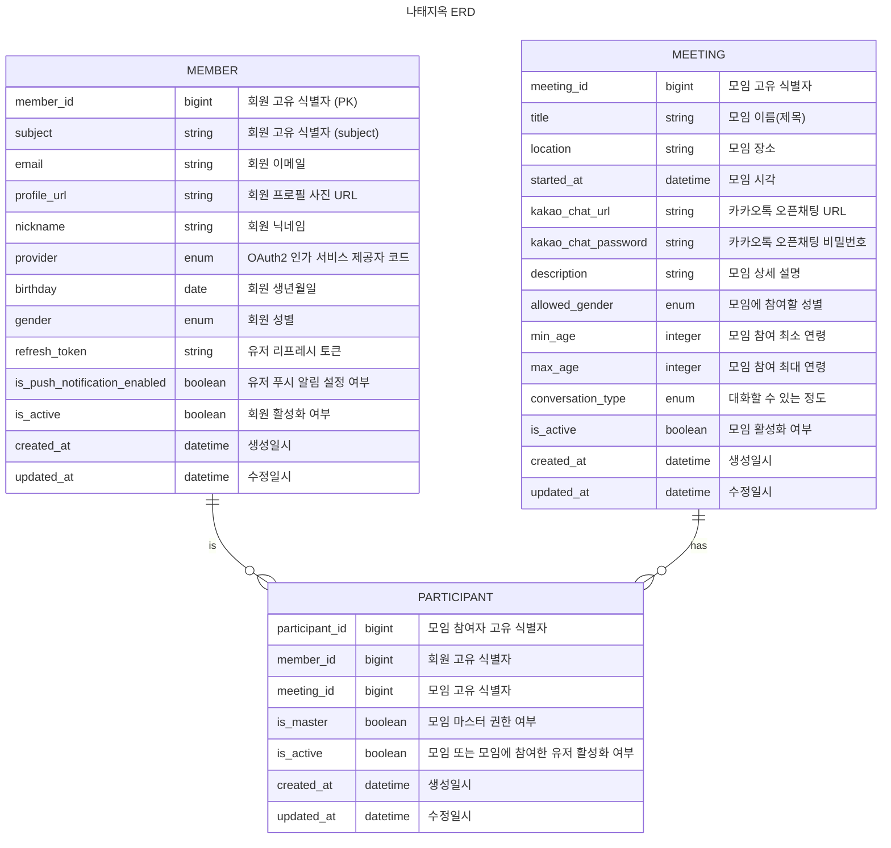

# 나태지옥

## ERD

```mermaid
---
title: 나태지옥 ERD
---
erDiagram
    MEMBER ||--o{ PARTICIPANT : is
    MEMBER {
        member_id bigint "회원 고유 식별자 (PK)"
        subject string "회원 고유 식별자 (subject)"
        email string "회원 이메일"
        profile_url string "회원 프로필 사진 URL"
        nickname string "회원 닉네임"
        provider enum "OAuth2 인가 서비스 제공자 코드"
        birthday date "회원 생년월일"
        gender enum "회원 성별"
        refresh_token string "유저 리프레시 토큰"
        is_push_notification_enabled boolean "유저 푸시 알림 설정 여부"
        is_active boolean "회원 활성화 여부"
        created_at datetime "생성일시"
        updated_at datetime "수정일시"
    }
    MEETING ||--o{ PARTICIPANT : has
    MEETING {
        meeting_id bigint "모임 고유 식별자"
        title string "모임 이름(제목)"
        location string "모임 장소"
        started_at datetime "모임 시각"
        kakao_chat_url string "카카오톡 오픈채팅 URL"
        kakao_chat_password string "카카오톡 오픈채팅 비밀번호"
        description string "모임 상세 설명"
        allowed_gender enum "모임에 참여할 성별"
        min_age integer "모임 참여 최소 연령"
        max_age integer "모임 참여 최대 연령"
        conversation_type enum "대화할 수 있는 정도"
        is_active boolean "모임 활성화 여부"
        created_at datetime "생성일시"
        updated_at datetime "수정일시"
    }
    PARTICIPANT {
        participant_id bigint "모임 참여자 고유 식별자"
        member_id bigint "회원 고유 식별자"
        meeting_id bigint "모임 고유 식별자"
        is_master boolean "모임 마스터 권한 여부"
        is_active boolean "모임 또는 모임에 참여한 유저 활성화 여부"
        created_at datetime "생성일시"
        updated_at datetime "수정일시"
    }
```
